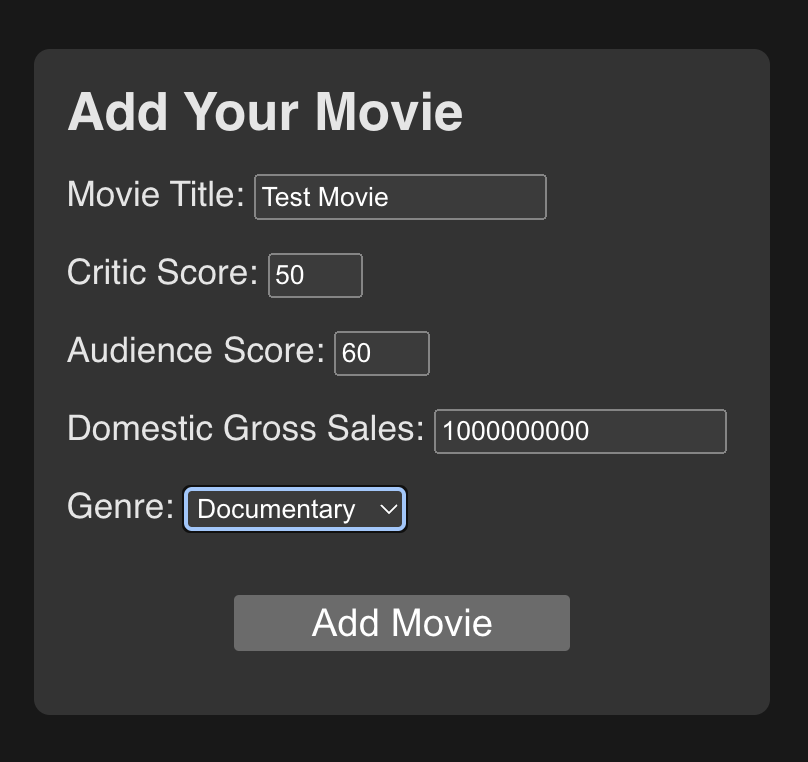
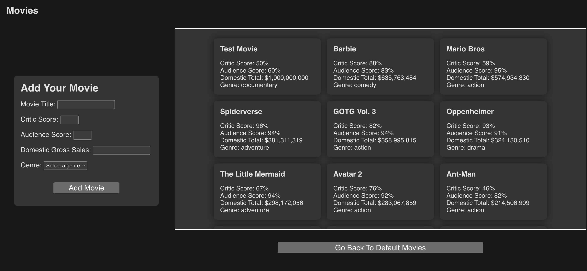
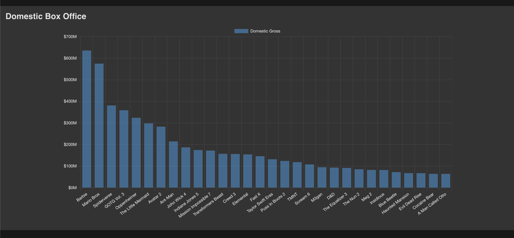
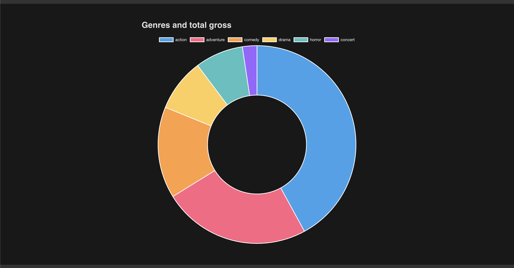
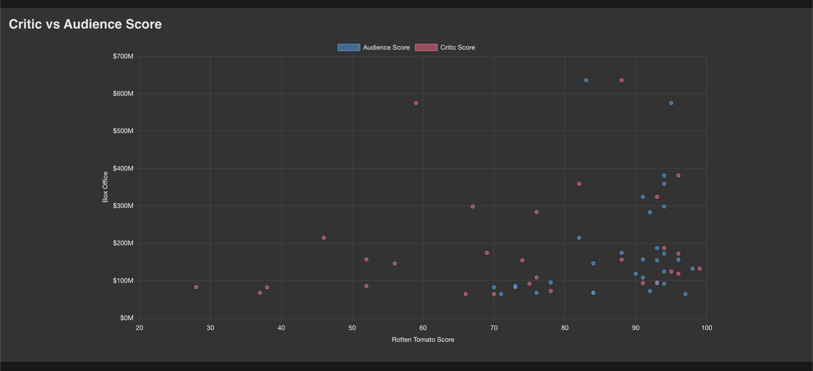

# 2.3.0 - Solo Project: Compare Movies (with Chart.js)
- [2.3.0 - Solo Project: Compare Movies (with Chart.js)](#230---solo-project-compare-movies-with-chartjs)
- [Project Description](#project-description)
  - [Part 1: DOM Manipulation (movies and the form)](#part-1-dom-manipulation-movies-and-the-form)
  - [Part 2: Chart.js](#part-2-chartjs)
- [Vite and Getting Started](#vite-and-getting-started)
- [User Stories](#user-stories)
  - [Data Analysis](#data-analysis)
- [Site examples](#site-examples)
  - [Charts](#charts)
- [Tech Tips](#tech-tips)
  - [movie-data.json](#movie-datajson)
  - [Saving to localStorage](#saving-to-localstorage)
  - [Chart.js](#chartjs)
  - [Accessibility](#accessibility)
- [Tech Rubric](#tech-rubric)
  - [Layout: Structure](#layout-structure)
  - [layout: Accessibility](#layout-accessibility)
  - [Functionality](#functionality)
  - [Meta](#meta)

In this lab we'll be working with [the Chart.js library](https://www.chartjs.org/) to render out some charts on some of 2023's top movies, and we can even add some movies of our own. This is a a more difficult solo project as it doesn't give as many hints, and requires you to learn the Chart.js library on your own. If you would like to focus solely on DOM manipulation skills, try [2-3-0-solo-project_palette-picker](https://github.com/The-Marcy-Lab-School/2-3-0-solo-project_palette-picker) instead. That being said, if you already feel confident about your DOM manipulation skills and would like a challenge and learn some data visualization skills, this is the lab for you!


# Project Description
## Part 1: DOM Manipulation (movies and the form)
To start, we'll load up all our movies from `localStorage` and display them in a list (either flex or grid, don't care). Then we're going to build a form that takes in the movies title, critic/audience score (from rotten tomatoes), the *domestic* gross and the movie genre. If you're curious why only domestic, it's just that it keeps the movies a little more in line with each other so the charts look nicer by default. Each and every input on that form is required in the html. (Do you know how to do that?) When a form is submitted the movie is added at the top of the list. There's also a button that will reset the list to the default movies.

## Part 2: Chart.js
The above is important because it shows you really do know the core of DOM manipulation skills. But now it's time to experiment with a new library. We would like you to include 3 charts. One of them must be a bar chart that shows the movies in order of their domestic totals. This is the simplest chart type and a good way to see how Chart.js works. The other two sections are totally up to you, feel free to copy the charts given in our example site, but you can also do anything you want.

# Vite and Getting Started
We're using vanilla js, but with Vite (rhymes with feet) to handle dependencies like Chart JS. If you know how to use Vite to get started, get going! If not, try the [Vite section in the other lab](https://github.com/The-Marcy-Lab-School/2-3-0-solo-project_palette-picker#vite-and-getting-started), which should answer some questions.

# User Stories
As with all projects, the best place to start is to figure out what a user can and cannot do on your site. Here are all the user stories for this project:

A user:
- Can see a list of movies on the page on load
- Can use a form to add a new movie
- Cannot submit the form without all the fields filled out
- Can see the new movie added to the list
- Can click a button to reset the movies back to the original ~30 movies
- Can see a bar chart of the movies sorted by domestic gross
- Can see a second chart of data
- Can see a third chart of data
- Can interact with the charts to reveal more information (like through a tooltip)

This one is simpler because we are intentionally leaving you some wiggle room

## Data Analysis
This is us dipping our toes into the waters of data visualization. You only have about 4 pieces of data per movie, but that's actually a lot to play with! Try to come up with interesting charts, and if you *want* you can even include some text below the chart to tell us what conclusions you drew from the data.

It's ok that a user could add a bunch of new movies to break the trend, this is just a practice DOM manipulation project, and ordinarily, users can't just add their own data to our studies!

# Site examples
You can also check the `images` folder, but if you're reading on GitHub, here they are:

Here's the form with all the fields filled out:


And here's the result of adding a movie:

See how the movie is added to the top of the list? That's much easier for debugging, so let's stick with that. The bar chart should always be sorted though!

## Charts
Here are some examples of charts, and remember to check the docs for more examples!



You could also use a pie chart, doughnut charts just add a little *extra* flair.


Scatter plots are useful to show 3 dimensions of data, an X and Y axis, but then also the data about the point. The general dots show a trend, but itf you hover over them you can see which movie is which.

# Tech Tips
Here are a few helpful things to get started

## movie-data.json
We're giving you some default movies to start with in `movie-data.json` (copy it into your repo). And what's super cool about JSON is that you can read the file type from the browser. How? We don't have the Node fs module, no we can just import it directly, like this:

```js
// data-store.js

import movieData from './movie-data.json'
console.log(movieData); // It's now regular JS code!
```

Pretty cool right? The only catch is you must specify the file type `.json`.

## Saving to localStorage
> We do not want to use sessionStorage that's different!

We want any of our user added movies to persist across sessions. We don't need databases to do this, assuming we're ok with only saving the data to the user's browser. Here's an [article explaining localStorage](https://www.freecodecamp.org/news/how-to-store-data-in-web-browser-storage-localstorage-and-session-storage-explained/).

Once you understand the basics of localStorage, you can make some helper functions like:

- setLocalStorageKey(key, value)
  - This is a wrapper that automatically stringifies the value and sets it to the key
- getLocalStorageKey(key)
  - This is a wrapper that automatically parses the value and returns it, but also handles the errors (JSON.parse should always be wrapped in a try/catch since it breaks so easily). If there's an error it console.errors it and returns null

With those two out of the way, you can make some more focused helper functions like:

- getMovies()
  - This should return an array of movies from localStorage, or an empty array if there are none
- setMovies(movies)
  - This should save the movies to localStorage
- addMovie(movie)
  - This should add a movie to the movies array in localStorage
- resetMovies()
  - This should reset the movies to the default movies
- initMoviesIfEmpty()
  - This should check if there are any movies in localStorage, and if not, it should set the default movies.

Remember these functions are all only the data layer of our project. None of them should be touching the DOM, that's the job of other rendering functions.

## Chart.js
This is such a fun library. It's built on top of D3 (a much more intense data visualization library) and makes it much easier to get started. Check out the [getting started section in the docs](https://www.chartjs.org/docs/latest/getting-started/) to get up and running.

Here's a tip: if you want to redraw a chart, the easiest way to do it is to just remove the canvas element entirely, and then remake the chart. There are `remove` and `update` methods, but it's just do something like:

```js
const draw = (parentElement) => {
  parentElement.innerHTML = ''
  const canvas = document.createElement('canvas')
  // ... set up the canvas with chart js
  parentElement.appendChild(canvas)
}
```

Be careful when redrawing that the *data* you're pulling from is updated too! So like make sure that `getMovies` would be called *inside* your draw function to make sure you're getting the latest data.

Also, when you hover over a bar or section of a chart, a little "tooltip" pops up. You can customize that tooltip with a callback function. Here's an example:

```js
const barConfig = {
  type: 'whatever',
  data,
  options: {
    plugins: {
      tooltip: {
        callbacks: {
          label(data) {
            return the new label
  // ...
```

You can include a little more helpful information this way. **We would like you to modify at least one tooltip to include the non default information** (even if that is just formatting the default information nicely).

I can't get into everything, but the library lets you customize a LOT of stuff, don't get lost. Focus first on the charts and then on the customization.

## Accessibility
Don't forget to make your site accessible! Each chart should be in its own `section` with a heading, and the form should have all the proper labels as well.


# Tech Rubric
In order to see how well you're doing with this project, here are all the things we need would like to see from you. If you get all of these, then you know that you're where you need to be!

Something new is that the fixed height of the movies display container needs a `tabindex="0"` attribute on the list. That allows a keyboard only user to tab into it, and then control scrolling with the space/arrow keys. Here is more [information about tabindex and keyboard scrolling](https://accessibilityinsights.io/info-examples/web/scrollable-region-focusable/)

## Layout: Structure
- [ ] There is a single `main` element on the page
- [ ] There is a single `h1` element on the page
- [ ] There is a `form`
- [ ] The form has an `h2` label
- [ ] The form has an `text` input and label for the movie title
- [ ] The form has an `number` input and label for the movie's critic score
- [ ] The form has an `number` input and label for the movie's audience score
- [ ] The form has an `number` input and label for the movie's domestic gross
- [ ] The form has a `select` input and label for the movie's genre with options:
  - ['Action', 'Adventure', 'Comedy', 'Drama', 'Horror', 'Concert', 'Documentary', 'Musical', 'Romance', 'Sci-Fi', 'Thriller']
- [ ] The `select` input starts with "Select a genre" with *no* value
- [ ] Every single input on the form is required in the html
- [ ] The form has a `button` to submit the form
- [ ] There is an `h2` showing for every section of the page
- [ ] There are actual `section` tags to denote each section
- [ ] There is a `button` under the `ul` to reset the movies to the default movies
- [ ] The movies are each in `li` elements inside a `ul` element
- [ ] The movies are displayed in a grid-like pattern (flex or grid)
- [ ] There is a bar chart using Chart.js
- [ ] There is a second chart using Chart.js
- [ ] There is a third chart using Chart.js

## layout: Accessibility
- [ ] The form has an `aria-label` or `aria-labelledby` attribute that describes the form
- [ ] Each section has an `aria-label` or `aria-labelledby` attribute that describes the section
- [ ] There are no instances of recreating any semantic elements
- [ ] There is a tab index on the scrollable movies section
- [ ] Each movie card has an `h3` with the movies title so they can easily be identified and navigated to by screen readers

## Functionality
- [ ] Every form field is required, and the form cannot be submitted without them
- [ ] Clicking the form submit button does not reload the page because the default behavior is prevented
- [ ] Clicking the form submit button creates a new movie in the movies section
- [ ] Clicking the form submit button clears the form
- [ ] When a movie is added, all charts are rerendered to show the new movie
- [ ] At least one chart has a modified tooltip display
- [ ] Clicking the reset button removes all user added movies and resets the movies to the default list
- [ ] The movies are saved to localStorage
- [ ] The movies are loaded from localStorage on page load

## Meta
- [ ] The project is created using Vite
- [ ] The code exists in more than one JS file
- [ ] The project is deployed via GitHub Pages properly
- [ ] The `movie-data.json` file is read properly
- [ ] css flexbox or grid was used
- [ ] The code does not render unescaped text directly to the DOM (`createElement`` or other escape method used)
- [ ] `.innerHTML` or `createElement/.append` is used properly at some point in the project
- [ ] `.innerHTML` or `.remove()` is used to delete elements from the DOM.


